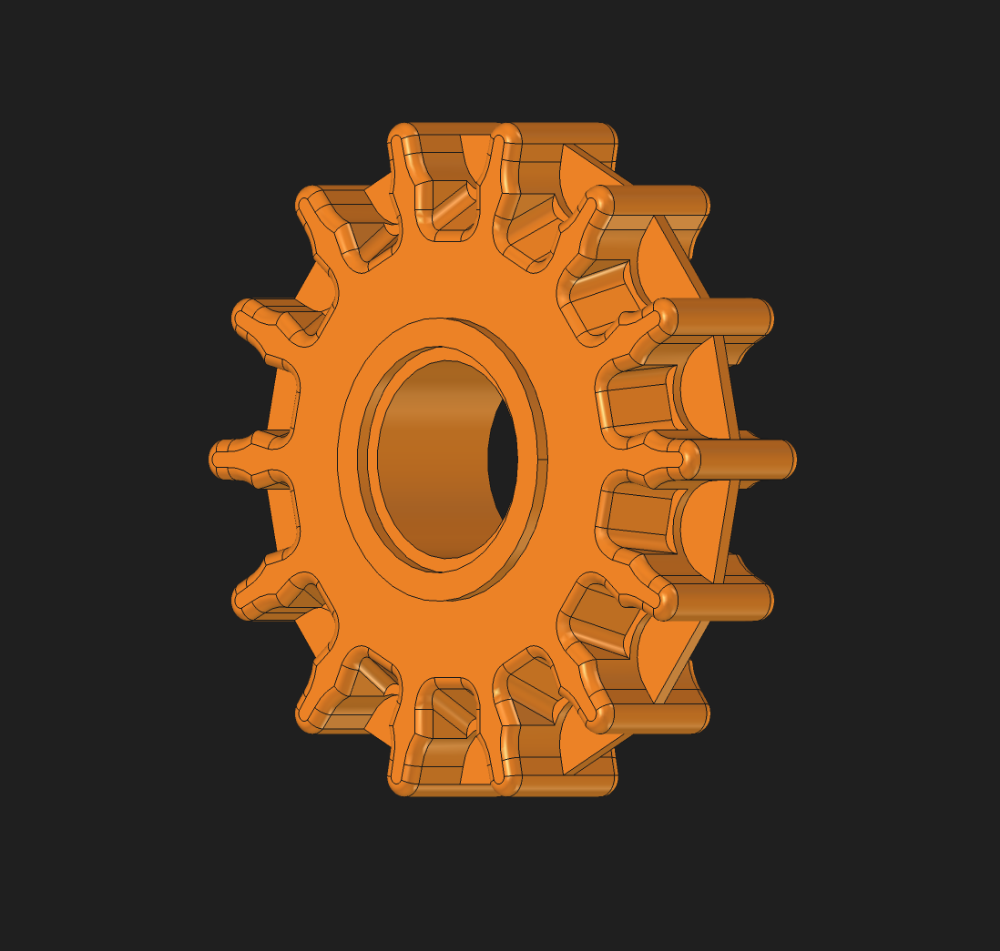
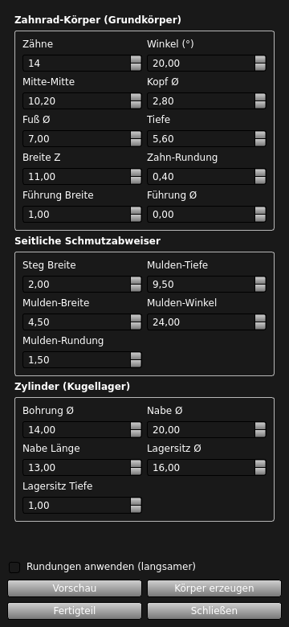
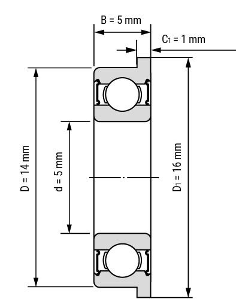

# Gates CDX Belt Tensioner Sprocket Generator (Brompton)

> Deutsche Version: [README.de.md](README.de.md)

This tool generates parametric **pulley wheels / guide sprockets for the original or modified Brompton belt tensioner** when the folding bike has been converted to the **Gates Carbon Drive (CDX)** belt drive system (e.g., via a Kinetics conversion). The sprockets are generated as finished 3D solids – optimized for 3D printing or CNC milling.

**Important:** This is *not* a load-bearing drive sprocket for the rear hub, but a ball-bearing **idler pulley / guide sprocket for the belt tensioner**!

## Quick Start: Configure Online – No Installation Required

In the web configurator, you can **rotate and adjust the tensioner sprocket live in 3D**. The tooth profile, debris mud ports, belt guide, hub, and ball bearing seats update instantly based on your preferences.

**Two ways to download:**
* **Download ready-made STLs:** Pre-rounded files are available for standard sizes from **12 to 18 teeth** (also available with STEP files in the [Release "stl-serie"](https://github.com/kaysiebke-cell/gates-cdx-kettenspanner-ritzel-generator-brompton/releases/tag/stl-serie)).
* **Generate custom dimensions:** You can enter the parameters freely (tooth count **12–18**) and drag the STL directly out of your browser (fillets are approximated here; the exact CAD fillets are included in the release files).

## Direct Usage in FreeCAD

1. Copy the project folder into your FreeCAD macro directory (or any location of your choice).
2. Run `freecad/main.py` as a macro in FreeCAD. The **"Zahnrad Setup"** (Gear Setup) panel will automatically dock on the right side.

| Button | Function |
|---|---|
| **Vorschau** (Preview) | Redraws only the sketch of the tooth profile (extremely fast). |
| **Körper erzeugen** (Create Body) | Builds the complete PartDesign solid body. |
| **Fertigteil** (Finished Part) | Creates a clean copy (`RitzelFertig`) without the feature tree – perfect for STL/STEP export. |

**Tip:** The **"Rundungen anwenden"** (Apply Fillets) checkbox controls the fillets. Since these consume the most performance during calculation, it is best to leave them unchecked for quick drafts. Enable them only for the final part export.

**Prerequisites:** FreeCAD 1.1+ (tested as Flatpak on Linux), no additional dependencies. The panel UI is in German.

## Features

* **Fully Parametric:** Tooth count (**12–18**), pressure angle, pitch, tip/root radius, and tooth depth can be freely adjusted.
* **Thoughtful Geometry:** Central ridge acting as a belt guide, lateral mud/debris ports (angle, depth, and radius adjustable), plus a bore and counterbores for the belt tensioner bearings.
* **Smart UI:** The dock panel is clearly structured and automatically adapts to the FreeCAD theme (Light/Dark Mode).
* **Remembers Settings:** The last used parameters are automatically reloaded on the next startup.
* **Fillet Cache:** The tool remembers working radii. If a calculation fails, it doesn't completely reset, saving expensive processing time.
* **Cloud-Build & Web Configurator:** Fully usable in the browser if you don't have FreeCAD installed.

## 3D Printing (PA12-CF)

Configure the sprocket live in the [online tool](https://kaysiebke-cell.github.io/gates-cdx-kettenspanner-ritzel-generator-brompton/); its **Druck-Empfehlungen / Print guide** tab and the section below are generated from the same source (`web/js/print-data.js`), so they never drift apart.

<!-- PRINT:START (auto-generiert aus web/js/print-data.js – nicht von Hand ändern; `npm run build`) -->
> ✅ Field-tested: PA12-CF has proven itself in real continuous operation and meets the requirements – mileage of 2,800–2,850 km over about 5 months and still in use.
>
> **PA12-CF properties:** highly wear-resistant · stiff & dimensionally stable · low moisture absorption · good sliding properties (quiet running) · high fatigue endurance · chemically resistant · lightweight

### Print settings

| Parameter | Recommendation | Details |
|---|---|---|
| **Filament** | PA12-CF | Carbon-fiber reinforced nylon – extremely wear-resistant, stiff, absorbs less moisture than PA6. |
| **Nozzle** | ≥ 0.4 mm, hardened steel | CF fibers clog smaller nozzles and wear out brass – use a hardened steel (or ruby) nozzle. |
| **Infill** | 100% | Maximum stability and durability of the flanges – full infill is required. |
| **Layer height** | 0.12–0.16 mm | Fine layers for smooth running – the tooth flanks guide the belt, fine layers = low-vibration operation. |
| **Print speed** | Slow (~20–40 mm/s) | CF filament is abrasive and viscous – slower printing improves layer adhesion and dimensional accuracy. |
| **Cooling (part fan)** | 0–20% (as little as possible) | Too much cooling weakens layer adhesion – print PA12-CF with no or only minimal part cooling. |
| **Orientation** | Flat on the large face | Teeth are printed sideways – no support material needed on the flanks. |
| **Support** | Only hub & openings | The 1 mm deep bearing seat prints perfectly without supports. |
| **Nozzle temperature** | 250–280 °C (start: 260 °C) | PA12-CF needs high temperatures. Start at 260 °C, adjust ±5 °C as needed. The CF variant needs stable heat. |
| **Bed temperature** | 80–120 °C | PA12-CF needs a heated bed. Higher temperatures reduce warping and layer separation. |
| **Chamber temperature** | 60–80 °C | With enclosure: noticeably stabilizes print quality. PA12-CF is demanding – chamber control pays off. |
| **Drying** | 8 hours at 70 °C | Dry before printing (if the spool was left open). For long prints keep the spool in a drybox / with desiccant – nylon keeps absorbing moisture during printing. |

### Compatible printers for PA12-CF

- Prusa XL + Enclosure
- Bambu Lab X1 Carbon
- Prusa MK3S+ / MK3.9S + Enclosure
- Zortrax M300+ / M300 Dual
- Ultimaker S5 Pro

**Requirements:** Heated bed (80–120 °C) · Temperature-controlled chamber (ideal 60–80 °C) · Reliable cooling · Good bed adhesion (Bondtech, PEI, Garolite)

### Important notes

1. **PA12-CF is demanding** – not for beginners.
2. **Storage** – dry environment, silica gel.
3. **Annealing (optional)** – controlled annealing after printing (per manufacturer spec, often 1–2 h just below the softening temperature, then cool slowly) increases strength and dimensional stability under continuous mechanical load. Test on a sample first – slight warping is possible.
4. **Bearing-seat fit** – PA12-CF shrinks as it cools. Proven value: make the bearing-seat diameter +0.2 mm larger (14 mm bearing → 14.2 mm) for a firm press fit (e.g. F605-2RS). Verify on your own printer with a test print (shrinkage varies).
5. **Fracture strength** – PA12-CF is very stiff but more brittle than PA12. Do not overload.
6. **Check print quality** – make first samples before mass production.
7. **Health** – post-processing (sanding/drilling) creates irritating CF fine dust. Use extraction and a dust mask (FFP2/FFP3).

### Surface smoothing & sealing (optional)

> ⚠️ Mask functional surfaces – do not coat or sand: bearing seat (F605-2RS, +0.2 mm), tooth flanks (belt contact) and bore/axle seat.

1. **Fill** – Fill layer lines with thin cyanoacrylate (CA), epoxy (e.g. XTC-3D) or 2K filler primer – sanding alone is not enough on CF nylon.
2. **Wet-sand** – work through 240 → 400 → 600 → 1000+, wet-sanding – it binds the irritating CF fine dust. Wear an FFP2/FFP3 mask for dry work.
3. **Seal** – apply a thin epoxy or 2K PU clear coat (UV/weather-resistant). Degrease and lightly scuff the nylon first (poor adhesion otherwise); use a plastic adhesion promoter if needed.
4. **Order** – if annealing: anneal first, then seal (heat destroys coatings).
5. **Not advisable** – chemical vapour smoothing needs formic acid (toxic/corrosive) – avoid for hobby use; heat gun/flame warps CF nylon.

> ⚠️ This information is based on research (manufacturer specs, printer documentation, community experience, datasheets) and hands-on field experience (see box above). No guarantee – please test yourself before use and cross-check with current sources. For hobby projects; no commercial use without permission.
<!-- PRINT:END -->

## Matching Ball Bearings

The default values (Bore Ø 14 mm, bearing seat Ø 16 mm × 1 mm) are designed exactly for the **F605-2RS (5 × 14 × 5 mm)** miniature flanged ball bearing, which fits perfectly onto the Brompton belt tensioner axle. You will need 2 pieces (one per side), with the flange resting in the 1 mm deep recess.

* **Important:** Be sure to get the **2RS variant** (rubber-sealed on both sides). They provide much better protection against rain and road grit on the belt tensioner than metal-shielded (ZZ) versions.
* For all-weather commuters, the stainless steel version **SF605-2RS** is highly recommended.
* **Test the Fit:** PA12-CF shrinks as it cools. The author's proven value is to make the bearing-seat diameter **+0.2 mm** larger (e.g. a 14 mm bearing → 14.2 mm) for a firm press fit. Shrinkage varies by printer, so print a small test ring first and fine-tune the `Bore Ø` parameter in 0.1 mm steps.
* **Press, Don't Hammer:** Carefully press the bearings into place (e.g., using a vise with a matching washer). Apply force only to the outer ring, never to the inner ring.

## File Structure

| File | Content |
|---|---|
| `freecad/main.py` | The entry point for FreeCAD, cleanly imports all modules. |
| `freecad/zahnrad_ui.py` | The control panel (inputs, buttons, saving values). |
| `freecad/zahnrad_generator.py` | The actual geometry: Tooth profile sketch and 3D body generation. |
| `freecad/zahnrad_params.py` | Definition of variables and default values. |
| `web/index.html` | The web configurator (hosted via GitHub Pages). |
| `freecad/build_headless.py` | Helper script: Builds the release series (STEP/STL) in the background without a GUI. |
| `freecad/render_gui_preview.py` | Cloud Build: Renders the preview using Xvfb. |
| `freecad/ritzel_params.py` | Cloud Build: Default values and JSON overrides. |
| `.github/workflows/build-ritzel.yml` | GitHub Action for automated builds. |

## Legal Disclaimer & Liability

Gates® and CDX® are registered trademarks of Gates Corporation; Brompton and Kinetics are trademarks of their respective owners. This project is an independent hobbyist tool. It is not affiliated with the manufacturers and does not use original manufacturing data – the geometry was independently measured and reverse-engineered from a retail part.

**For Private Use Only:** Components of the Gates Carbon Drive System may be protected by patents. In many jurisdictions (e.g., according to § 11 No. 1 PatG in Germany), private, non-commercial production for one's own bicycle is exempt from patent protection. However, **commercial production or sale** of the generated sprockets may infringe upon third-party rights and is done entirely at your own risk.

The use of self-printed components in public traffic is at your own responsibility.
