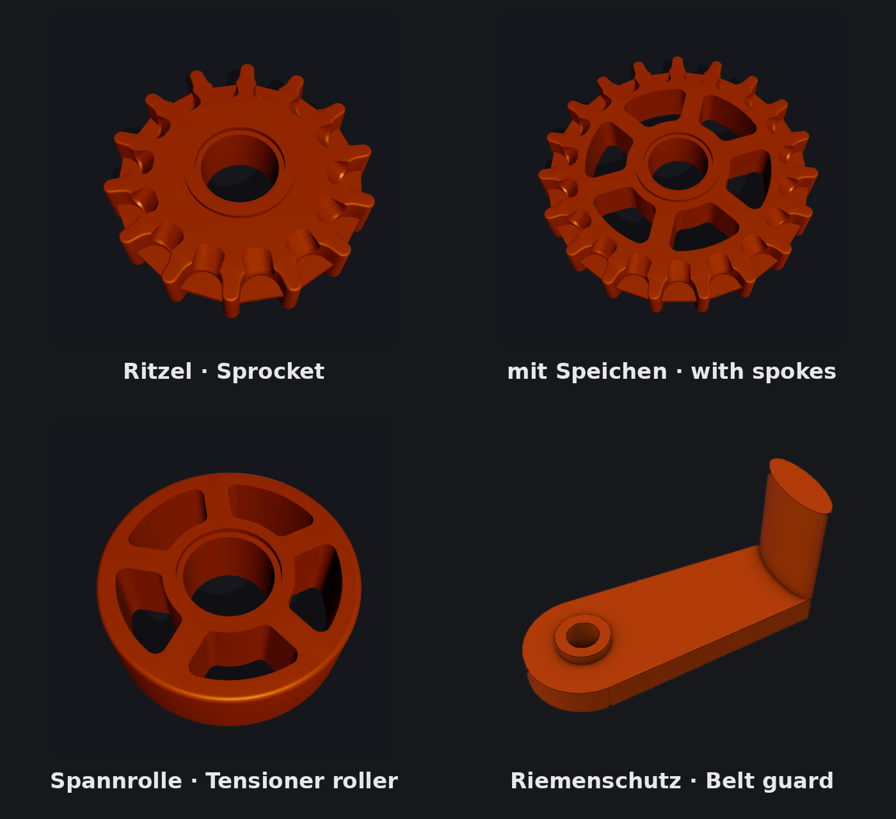
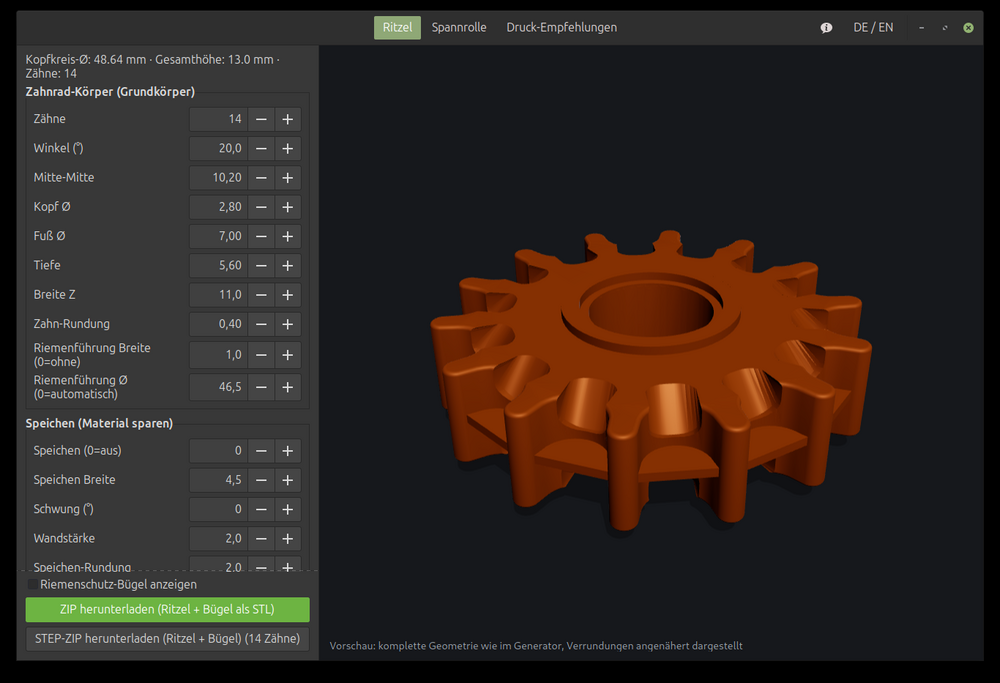
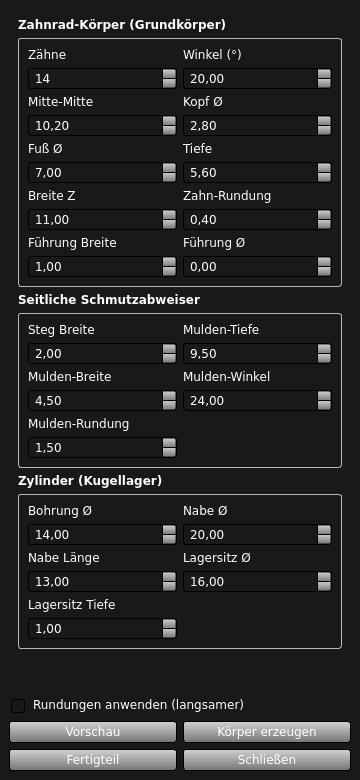

# Gates CDX Belt Tensioner Sprocket Generator (Brompton)

**Parametric generator for idler pulleys and guide sprockets of the Brompton belt tensioner – as a web page, Android app, Linux program and FreeCAD panel.**

> Deutsche Version: [README.de.md](README.de.md)

   

---

## What it is

This tool generates parametric **idler pulleys and guide sprockets for the original or modified Brompton belt tensioner** when the folding bike has been converted to the **Gates Carbon Drive (CDX)** belt drive (e.g. via a Kinetics conversion). The parts are produced as finished 3D solids – optimised for 3D printing or CNC milling.

**Important:** This is *not* a load-bearing drive sprocket for the rear hub, but a ball-bearing **idler pulley / guide sprocket for the belt tensioner**.

---

## Four versions

<table>
<tr>
<td width="50%" valign="top" align="center"> <b>Web (browser)</b> Nothing to install – configure in the browser and download STL/STEP.</td>
<td width="50%" valign="top" align="center"> <b>Linux app (GTK, Cinnamon)</b> Own window in your system theme, no browser, works offline.</td>
</tr>
<tr>
<td width="50%" valign="top" align="center"> <b>Android app</b> On your phone, works offline. Install via APK.</td>
<td width="50%" valign="top" align="center"> <b>FreeCAD panel</b> Exact CAD bodies with real fillets, STEP/STL from FreeCAD.</td>
</tr>
</table>

| I want to … | Version |
|---|---|
| try it quickly | **Web** |
| work at the computer without a browser | **Linux app** |
| use it on the go on my phone | **Android app** |
| exact fillets and my own changes to the body | **FreeCAD** |

→ All differences in detail: [Versions compared](docs/en/versionen.md)

---

## Quick start

1. **Web:** [Open the configurator](https://kaysiebke-cell.github.io/gates-cdx-kettenspanner-ritzel-generator-brompton/) – enter values, download STL or STEP.
2. **Linux app:** run `linux/bauen-deb.sh`, then `sudo apt install ./linux/dist/ritzel-generator_*_all.deb` → "Ritzel-Generator" in the menu. → [Details](docs/en/linux-app.md)
3. **Android:** [download the APK](https://github.com/kaysiebke-cell/gates-cdx-kettenspanner-ritzel-generator-brompton/releases/download/app/ritzel-generator.apk) and install it. → [Details](docs/en/android.md)
4. **FreeCAD:** copy the project folder, run `freecad/main.py` as a macro – the panel "Zahnrad Setup" docks on the right. → [Details](docs/en/freecad.md)

---

## Highlights

* **Fully parametric:** tooth count (**12–19**), pressure angle, pitch, tip/root radius and tooth depth freely adjustable.
* **Thought-out geometry:** central web as belt guide (width and Ø adjustable, Ø 0 = automatic), side debris pockets, bore and steps for the tensioner's ball bearings.
* **Spokes to save material:** openings in the web, straight or swept – about a quarter less material at 19 teeth. → [Spokes](docs/en/speichen.md)
* **Print-ready files:** STL meshes are closed (slicer-ready without repair), STEP with exact CAD fillets.
* **The idler roller and the belt guard** can be generated too.
* **Four versions, one source:** `params.json` is the single source for fields and defaults; `npm test` and `npm run test:dicht` keep web and CAD identical and check the meshes.
* **Proven in practice:** PA12-CF in daily use, over 2800 km. → [3D printing](docs/en/3d-druck.md)

---

## Documentation

The pages are meant to be read in this order.

| Topic | Page |
|---|---|
| 1 · The four versions compared | [versionen.md](docs/en/versionen.md) |
| 2 · Web version | [web.md](docs/en/web.md) |
| 3 · Linux app (GTK, Cinnamon) | [linux-app.md](docs/en/linux-app.md) |
| 4 · Android app | [android.md](docs/en/android.md) |
| 5 · FreeCAD panel | [freecad.md](docs/en/freecad.md) |
| 6 · 3D printing (PA12-CF) | [3d-druck.md](docs/en/3d-druck.md) |
| 7 · Spokes (save material) | [speichen.md](docs/en/speichen.md) |
| 8 · Matching ball bearings | [kugellager.md](docs/en/kugellager.md) |
| 9 · Project structure | [projektstruktur.md](docs/en/projektstruktur.md) |
| 10 · Legal disclaimer & liability | [rechtliches.md](docs/en/rechtliches.md) |

---

## Legal

Gates® and CDX® are registered trademarks of Gates Corporation; Brompton and Kinetics are trademarks of their respective owners. This project is an independent hobby tool with no connection to the manufacturers; the geometry was measured independently. **For private use only**; using the parts on the road is at your own risk. → [Legal disclaimer & liability](docs/en/rechtliches.md)
