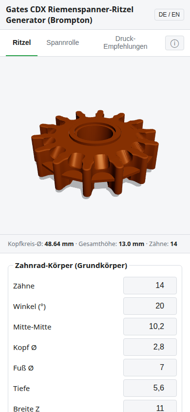

# Android-App

[← Übersicht](../../README.de.md) · [Alle Seiten](../../README.de.md#dokumentation)

---

Dieselbe Anwendung als **installierbare App** fürs Handy. Sie bringt alles mit und läuft offline.

**Herunterladen:** [ritzel-generator.apk](https://github.com/kaysiebke-cell/gates-cdx-kettenspanner-ritzel-generator-brompton/releases/download/app/ritzel-generator.apk) – der Link bleibt bei jeder neuen Fassung derselbe.

**Installieren:**

1. Den Link **im Handy-Browser** öffnen → die Datei lädt herunter.
2. Die Datei öffnen (Benachrichtigung oder Ordner „Downloads“).
3. „Aus dieser Quelle installieren“ erlauben → **Installieren**.

Eine neue Version einfach **über die alte** installieren, nicht vorher löschen.

**Besonderheiten:**

- ZIP mit STL wird auf dem Gerät gebaut und landet in „Downloads“.
- **STEP gibt es in der App nicht** (die Datei braucht ohnehin ein CAD-Programm am Rechner). Die fertigen STEP-Dateien liegen im Release „serie“.

Ausführliche Anleitung, Stolpersteine und das Signieren der App: [APK-HERUNTERLADEN.md](../../APK-HERUNTERLADEN.md).
