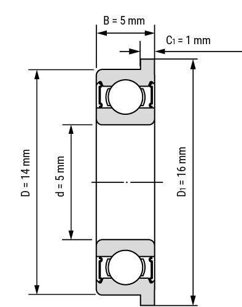

# Passende Kugellager

[← Übersicht](../../README.de.md) · [Alle Seiten](../../README.de.md#dokumentation)

---

Die Standardwerte (Bohrung Ø 14 mm, Lagersitz Ø 16 mm × 1 mm) sind exakt auf das Miniatur-Flanschkugellager **F605-2RS (5 × 14 × 5 mm)** ausgelegt, welches perfekt auf die Achse des Brompton-Riemenspanners passt. Man braucht 2 Stück (eins pro Seite), wobei der Flansch im 1 mm tiefen Absatz sitzt.

Bezugsquelle für Deutschland: [F605-2RS bei Kugellager-Express](https://www.kugellager-express.de/miniatur-flanschkugellager-f-605-2rs-5x14x5-mm)

* **Wichtig:** Unbedingt die **2RS-Variante** (beidseitig gummigedichtet) nehmen. Die dichten am Riemenspanner im spritzwassergefährdeten Bereich deutlich besser gegen Regen und Dreck ab als Metalldeckel (ZZ).
* Für Ganzjahresfahrer lohnt sich die Edelstahl-Version **SF605-2RS**.
* **Passung testen:** PA12-CF schwindet beim Abkühlen. Bewährter Praxiswert: den Lagersitz-Durchmesser um **+0,2 mm** größer auslegen (z. B. 14-mm-Lager → 14,2 mm) für einen festen Presssitz. Der Schwund variiert je Drucker – am besten erst einen kleinen Testring drucken und den Parameter `Bohrung Ø` in 0,1-mm-Schritten feinjustieren.
* **Pressen, nicht hämmern:** Die Lager vorsichtig einpressen (z. B. im Schraubstock mit einer passenden Unterlegscheibe). Druck nur auf den Außenring ausüben, niemals auf den Innenring.
