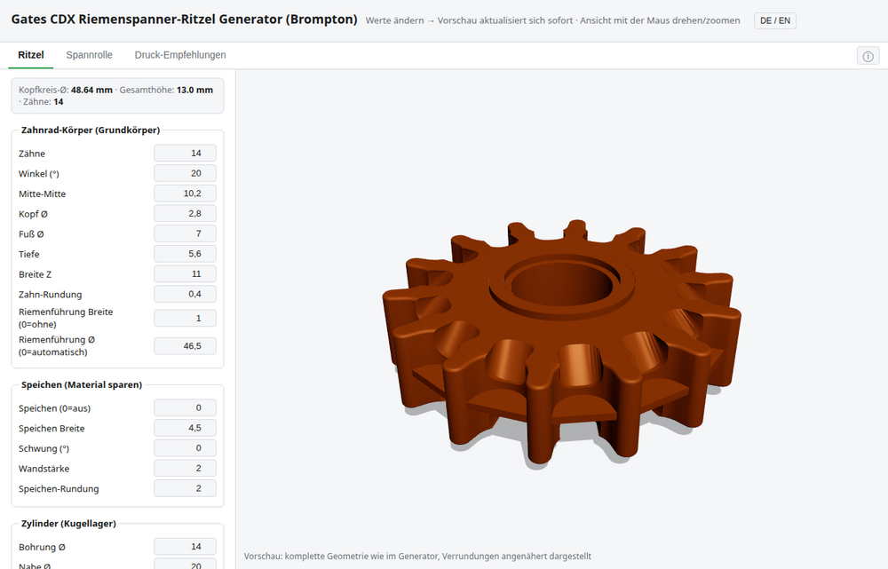

# Web version

[← Overview](../../README.md) · [All pages](../../README.md#documentation)

---

**Right in the browser, no installation:** <https://kaysiebke-cell.github.io/gates-cdx-kettenspanner-ritzel-generator-brompton/>

Tooth profile, debris pockets, belt guide, hub and bearing seats change instantly with your values. Rotate and zoom the 3D view with mouse or finger.

- The explanations of the fields are collapsed – the **ⓘ** button at the right of the tab bar shows and hides them. The choice is remembered for your next visit.
- Switch the language with **DE / EN**.
- Tabs **Sprocket**, **Idler roller** and **Print guide**.

**Two ways to download:**

- **Download ready-made files:** For the standard sizes **12 to 19 teeth**, finished rounded STL and STEP files are available (release "serie").
- **Custom dimensions:** Enter the values freely (tooth count **12–19**). The **STL** comes straight from the browser (fillets approximated). A **STEP** with exact CAD fillets is built by a cloud service in about 2–3 minutes.

The STL is a closed mesh that slicers (Orca, Prusa, Cura) read without repair.

**Note:** The "Install as app" button stores the web page as a browser app. That is **not** the Linux application, see [Linux app](linux-app.md).
